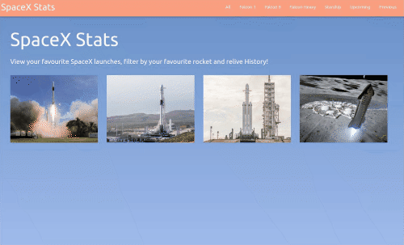

  <a>
    
  

  </a>

  <h2 align="center">SpaceX Stats - Catalogue of Statistics</h2>
  <h3 align="center">Built with React and Redux</h3>

  

    <a href="https://github.com/Azeem838/spacex-stats/issues">Report Bug</a>
    · 
    <a href="https://github.com/Azeem838/spacex-stats/issues">Request Feature</a>
  

## Built With

- React.js
- Redux.js
- Styled with Materialize-css
- Tested with Jest and react-testing-library
- [SpaceX API](https://github.com/r-spacex/SpaceX-API)
- ES6 JavaScript
- HTML, CSS

## Project Description

Welcome to the SpaceX Stats page. This page was built with React and Redux. It uses the [SpaceX API](https://github.com/r-spacex/SpaceX-API) form which, details of each launch are fetched, organised and displayed to you.

This project takes all the launches from the API and sorts then by type of rocket. The launches of the different rockets can be navigated in the Navbar at the top of the page or by clicking any 1 of the rockets on the Home Page.
Each rocket's image and details are displayed in a card on the page. Any of these cards are clickable, which will take you to a details page. This details page consists of an embedded YouTube video (the official live stream) as well as some other links to various articles and Reddit posts. Lastely, a swipable image gallery is displayed at the bottom of the page.

At the moment, 3 of the 4 SpaceX rockets have flown. Fingers crossed for Starship :smile:

## Live Demo

[Live Demo Link](https://spacex-stats-azeem.herokuapp.com/)

## Presentation

[Project Presentation](https://www.loom.com/share/80b548e6422e4c62a3b6924912b7a3bd)

## Getting Started

To get a local copy up and running follow these simple example steps.

### Prerequisites

Have a browser installed

### Setup

Clone this repo with <code>git@github.com:Azeem838/spacex-stats.git</code>

### Usage - Follow these

1. <code>cd</code> into the project directory
2. run <code>npm install</code>
3. Navigate to [localhost:8000](http://localhost:3000) in your browser.
4. Enjoy :smiley:

### Testing

The tests were written with React Testing Library and Jest.

Run `npm test` and on the prompt press `a`

Note: if you get an ASYNC timeout of 5 seconds, please re-run the tests, depending on your internet connection, the API might take a little longer to respond.

## Developer

:bust_in_silhouette: **Azeem Ahmed**

- Github: [@Azeem838](https://github.com/Azeem838)
- LinkedIn: [Azeem Ahmed](www.linkedin.com/in/azeemmahmed)

## 🤝 Contributing

Contributions, issues, and feature requests are welcome!

Feel free to check the [issues page](https://github.com/Azeem838/spacex-stats/issues).

## Show your support

Give a ⭐️ if you like this project!

## 📝 License

This project is [MIT](lic.url) licensed.
